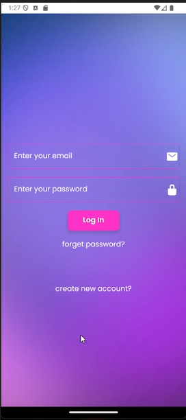
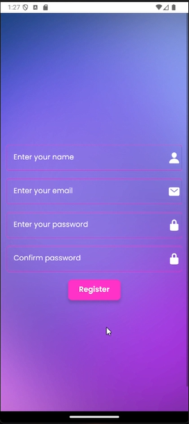
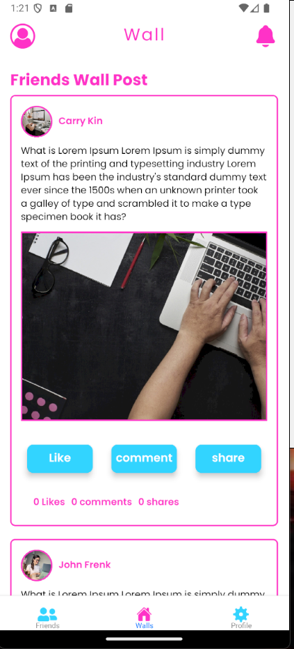
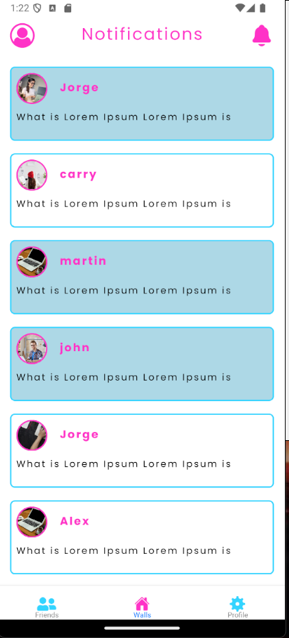
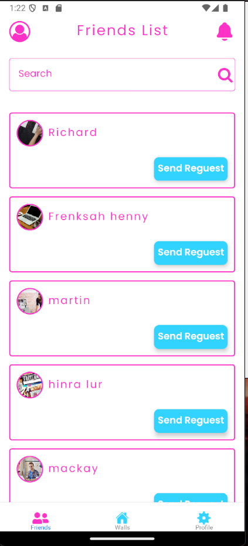
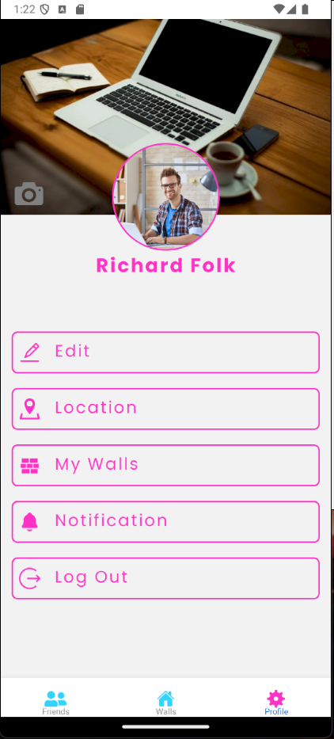

# Friends App

## 📱 Overview

**Friends App** is a private social networking application developed to help a specific community stay connected in a safe and supportive environment. The app was originally built around five years ago as a simple yet meaningful platform for users to communicate, share experiences, and engage with one another.

This application is designed with a focus on respectful interaction and community building. It provides a space where users can express themselves, connect with others, and participate in group-based conversations.

---

## ✨ Features

* 📝 **Posts & Sharing**
  Users can create posts to share their thoughts, experiences, and updates with the community.

* ❤️ **Likes & Engagement**
  Interact with posts by liking and engaging with other users’ content.

* 💬 **Real-Time Chat**
  Built-in messaging functionality allows users to communicate directly with each other.

* 👥 **Group Requests**
  Users can send and manage requests to join specific groups within the app.

* 🌐 **Community Interaction**
  A focused environment that encourages meaningful and respectful connections among members.

---

## 🛠️ Tech Stack

### Frontend

* React Native (Expo)

### Backend

* Firebase (Authentication, Database, and Storage)

---

## 🚀 Deployment

* The application has been built and deployed for **Android** via the **Google Play Store**.
* Expo was used during development to streamline testing and deployment.

---

## 🎯 Purpose

The primary goal of Friends App is to provide a **private, community-driven platform** where users can:

* Connect with like-minded individuals
* Share ideas and personal experiences
* Build meaningful relationships in a controlled environment

---

## ⚠️ Notes

* This application is intended for **community interaction and communication purposes only**.
* It promotes respectful engagement and does not support inappropriate or explicit content.
* As the app was developed several years ago, some dependencies and technologies may require updates for modern compatibility.

---

## 📌 Future Improvements

* Upgrade to the latest Expo SDK
* Improve UI/UX with modern design standards
* Enhance real-time performance
* Implement advanced notification features
* Strengthen security and scalability

---

**Login, Registration, Home, Chat, and Profile Screens**

|        |      |
| ----------------------------------------------- | --------------------------------------------- |
|  |  |
| ----------------------------------------------- | --------------------------------------------- |
|  |  |
| ----------------------------------------------- | --------------------------------------------- |

## 🎬 Demo Video

👉 [Watch Demo Video](./assets/App_ScreenShot/vidGif.gif)

## 👨‍💻 Author

**Muhammad Farooq Alam Abbasi**  
Hybrid App & Web Developer  
Portfolio: [https://farooqalam.com/portfolio](https://farooqalam.com/portfolio/)
LinkedIn: (https://www.linkedin.com/in/muhammad-farooq-alam-abbasi-174616153/)

---
